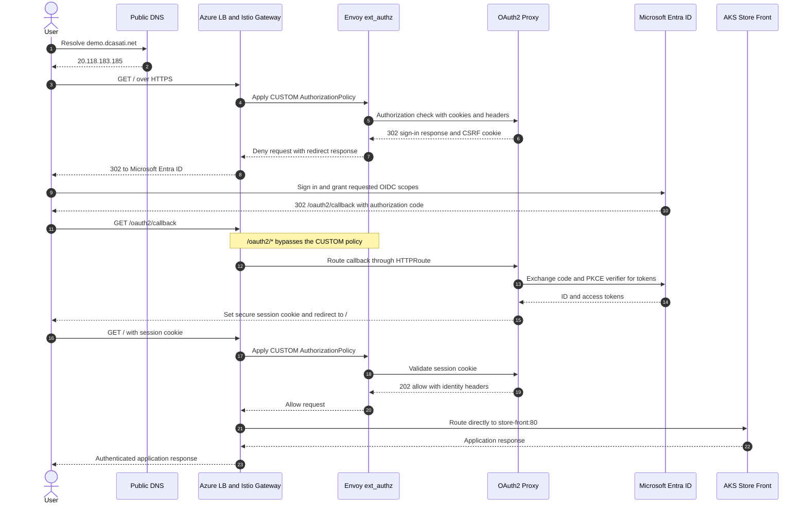

# AKS Store Demo with Istio Gateway and Microsoft Entra ID Authentication

This guide deploys the AKS Store Demo behind an external Istio Gateway API gateway and protects it with oauth2-proxy and Microsoft Entra ID. Istio uses an external authorization provider to validate each application request before forwarding it to the store.

The deployment also configures HTTPS with cert-manager, PKCE for the OpenID Connect authorization code flow, and AKS Workload Identity for the oauth2-proxy service account.

## Architecture Overview

```text
                                  Microsoft Entra ID
                              ┌────────────────────────┐
                              │  OIDC authorization    │
                              │  and token endpoint    │
                              └───────────▲────────────┘
                                          │
                                  Login and callback
                                          │
┌──────────┐    HTTPS     ┌───────────────┴──────────────┐
│  User    │─────────────▶│  Istio Gateway API Gateway  │
└──────────┘              │  TLS termination            │
                          └───────────────┬──────────────┘
                                          │ CUSTOM AuthorizationPolicy
                                          ▼
                          ┌──────────────────────────────┐
                          │  Envoy ext_authz provider   │
                          │  oauth2-proxy:4180          │
                          └───────────────┬──────────────┘
                                          │ Request allowed
                                          ▼
                          ┌──────────────────────────────┐
                          │  AKS Store Front            │
                          │  ClusterIP service          │
                          └──────────────────────────────┘
```

## Authentication Sequence



The sequence is also available as a standalone document in [oauth2-sequence.md](oauth2-sequence.md). The ACME path `/.well-known/acme-challenge/*` bypasses external authorization so cert-manager can issue and renew the TLS certificate.

Key principles:

- Store services use `ClusterIP`, preventing direct public access that bypasses authentication.
- Istio checks protected requests with oauth2-proxy through an `envoyExtAuthzHttp` extension provider.
- `/oauth2/*` bypasses the authorization policy so oauth2-proxy can handle sign-in and callbacks.
- `/.well-known/acme-challenge/*` bypasses authorization so Let's Encrypt can issue and renew the certificate.
- HTTP requests are redirected to HTTPS.
- The OpenID Connect flow uses PKCE with the `S256` challenge method.
- No kubeconfig, client secret, or cookie secret is committed to this repository.

## Prerequisites

- An Azure subscription and Microsoft Entra tenant
- Azure CLI authenticated with `az login`
- Permissions to create AKS clusters, managed identities, federated credentials, Entra applications, and service principals
- `kubectl`
- Helm 3
- `dig`, `openssl`, `sed`, and `base64`
- A DNS hostname if you do not want to use the automatically generated `sslip.io` hostname

The default configuration creates or uses these resources:

| Setting | Default |
|---|---|
| Resource group | `rg-ITSD-FDSS-POC` |
| Location | `westus3` |
| AKS cluster | `aks-ITSD-FDSS-POC-01` |
| Kubernetes namespace | `aks-store-demo` |
| Entra application | `aks-store-demo-oauth2-proxy` |
| User-assigned managed identity | `aks-store-demo-oauth2-proxy` |
| Istio revision | `asm-1-29` |
| oauth2-proxy version | `v7.15.2` |
| cert-manager version | `v1.21.1` |

## Create the AKS Cluster

The included [run.sh](run.sh) creates an AKS cluster with Azure CNI Overlay, the managed Istio add-on, OIDC issuer, and Workload Identity enabled.

1. Authenticate and select the target subscription:

   ```bash
   az login
   az account set --subscription "<subscription-name-or-id>"
   ```

2. Create the resource group:

   ```bash
   az group create \
     --name rg-ITSD-FDSS-POC \
     --location westus3
   ```

3. Review the values at the top of [run.sh](run.sh), then create the cluster:

   ```bash
   bash run.sh
   ```

   If you already have an AKS cluster, it must have the OIDC issuer, Workload Identity, and the managed Istio add-on enabled.

4. Download credentials to the local kubeconfig ignored by this repository:

   ```bash
   az aks get-credentials \
     --resource-group rg-ITSD-FDSS-POC \
     --name aks-ITSD-FDSS-POC-01 \
     --file ./cluster.config \
     --overwrite-existing

   export KUBECONFIG="${PWD}/cluster.config"
   kubectl get nodes
   ```

> Important: `cluster.config` contains cluster credentials and is intentionally excluded by [.gitignore](.gitignore). Do not commit or share it.

## Deploy with an Automatic sslip.io Hostname

The fastest path is to let the deployment script derive a hostname from the public gateway IP. For example, gateway IP `20.118.183.185` becomes `20-118-183-185.sslip.io`.

```bash
export KUBECONFIG="${PWD}/cluster.config"
bash deploy-store.sh
```

The script prints the final store URL, OAuth callback, gateway address, Entra application client ID, and managed identity client ID.

## Deploy with a Custom Domain

The hostname must resolve to the Istio gateway address before cert-manager requests the certificate. For a new deployment, run once with the automatic `sslip.io` hostname to create the gateway, then configure DNS and rerun with the custom URL.

1. Get the gateway address:

   ```bash
   export KUBECONFIG="${PWD}/cluster.config"

   kubectl get gateway store-external \
     --namespace aks-store-demo \
     --output jsonpath='{.status.addresses[0].value}'
   ```

2. Create a public DNS `A` record that points your hostname to that address.

3. Confirm public DNS resolution:

   ```bash
   dig +short @1.1.1.1 A demo.example.com
   ```

4. Deploy using the custom URL:

   ```bash
   export STORE_URL="https://demo.example.com"
   bash deploy-store.sh
   ```

The script updates the Entra redirect URI to `${STORE_URL}/oauth2/callback` and requests a matching Let's Encrypt certificate.

To use an existing certificate instead of cert-manager, set both certificate paths:

```bash
export STORE_URL="https://demo.example.com"
export TLS_CERT_FILE="${PWD}/tls.crt"
export TLS_KEY_FILE="${PWD}/tls.key"
bash deploy-store.sh
```

## What the Deployment Script Does

[deploy-store.sh](deploy-store.sh) performs the following operations:

1. Reads the AKS OIDC issuer and creates or reuses a user-assigned managed identity.
2. Creates a federated credential for the `aks-store-demo/oauth2-proxy` Kubernetes service account.
3. Deploys the upstream AKS Store Demo and converts its public store services to `ClusterIP`.
4. Creates and waits for the external Istio Gateway API gateway.
5. Validates that the selected hostname resolves to the gateway address.
6. Installs cert-manager and creates a Let's Encrypt certificate, unless certificate files are provided.
7. Creates or updates the single-tenant Entra application and its callback URI.
8. Creates the oauth2-proxy Kubernetes Secret without writing credentials to disk.
9. Configures the managed Istio add-on extension provider.
10. Deploys oauth2-proxy, the HTTPS routes, and the Istio `CUSTOM` authorization policy.

The script reuses the existing Kubernetes Secret on subsequent runs. This avoids creating a new Entra client secret every time it is executed.

## Authentication Flow

1. The user requests the store over HTTPS.
2. The Istio gateway applies the `CUSTOM` authorization policy.
3. Envoy sends an authorization check to oauth2-proxy.
4. Without a valid session, oauth2-proxy redirects the browser to Microsoft Entra ID.
5. Entra redirects the browser to `/oauth2/callback` with an authorization code.
6. oauth2-proxy exchanges the code using PKCE and creates a secure session cookie.
7. The browser retries the original request.
8. oauth2-proxy validates the session and Envoy forwards the request to `store-front`.

## Verify the Deployment

Check the gateway, routes, certificate, oauth2-proxy pods, and authorization policy:

```bash
export KUBECONFIG="${PWD}/cluster.config"

kubectl get gateway,httproute \
  --namespace aks-store-demo

kubectl get certificate store-tls \
  --namespace aks-store-demo

kubectl get pods \
  --namespace aks-store-demo \
  --selector app=oauth2-proxy

kubectl get authorizationpolicy store-oauth2 \
  --namespace aks-store-demo
```

An unauthenticated request should redirect to Microsoft Entra ID:

```bash
curl --head "${STORE_URL}"
```

Expected result: an HTTP `302` response with a Microsoft login URL in the `Location` header. Complete the interactive test in a private browser window by opening `${STORE_URL}`.

Verify that the store services are not directly exposed:

```bash
kubectl get service store-front store-admin \
  --namespace aks-store-demo
```

Both services should report `ClusterIP` under `TYPE`.

## Configuration

Override deployment defaults with environment variables:

```bash
RESOURCE_GROUP="rg-my-aks" \
CLUSTER_NAME="aks-my-cluster" \
LOCATION="eastus2" \
APP_NAME="my-store-oauth2-proxy" \
UAMI_NAME="my-store-oauth2-proxy" \
STORE_URL="https://store.example.com" \
bash deploy-store.sh
```

| Variable | Purpose |
|---|---|
| `KUBECONFIG` | Kubeconfig used by `kubectl` |
| `RESOURCE_GROUP` | Resource group containing the AKS cluster and managed identity |
| `CLUSTER_NAME` | Existing AKS cluster name |
| `LOCATION` | Azure region for the managed identity |
| `APP_NAME` | Microsoft Entra application display name |
| `UAMI_NAME` | User-assigned managed identity name |
| `STORE_URL` | Public HTTPS origin for the store |
| `TLS_CERT_FILE` | Optional PEM certificate path |
| `TLS_KEY_FILE` | Optional PEM private key path |
| `DNS_RESOLVER` | Resolver used to validate the public `A` record; defaults to `1.1.1.1` |

## Security and Production Considerations

| Area | Recommendation |
|---|---|
| Entra access | The generated app is single-tenant. Apply tenant policies and user or group assignment appropriate for the application. |
| Client secret | oauth2-proxy uses an Entra client secret for the OIDC code exchange. For production, store and rotate it through an approved secret-management process such as Azure Key Vault with the Secrets Store CSI Driver. |
| Workload Identity | The service account is federated with a dedicated managed identity. Grant that identity only the Azure roles required by future integrations. |
| Gateway scope | Keep backend services on `ClusterIP` and prevent alternate ingress paths that bypass the authorization policy. |
| Authorization bypasses | Keep `/oauth2/*` and the ACME challenge path narrowly scoped. Review any additional exclusions carefully. |
| Images | Pin images by digest and use an approved private registry for production workloads. |
| Availability | The proxy runs two replicas. Add topology spread constraints and a PodDisruptionBudget for production availability. |
| Network policy | Restrict access to oauth2-proxy and application services to the required Istio gateway traffic. |
| Observability | Collect Istio access logs, oauth2-proxy logs, AKS control-plane logs, and metrics with Azure Monitor or your standard platform. |
| Upgrades | Keep AKS, the managed Istio revision, cert-manager, and oauth2-proxy on supported versions and test upgrades in a non-production cluster. |

> Note: The pod is configured for AKS Workload Identity, but the current oauth2-proxy OIDC flow still uses the Entra confidential-client secret generated by the script. The managed identity does not replace that client secret in this implementation.

## Cleanup

Delete the application resources from the cluster:

```bash
export KUBECONFIG="${PWD}/cluster.config"
kubectl delete namespace aks-store-demo
```

Delete the Entra application and managed identity:

```bash
CLIENT_ID=$(az ad app list \
  --display-name aks-store-demo-oauth2-proxy \
  --query '[0].appId' \
  --output tsv)

if [[ -n "${CLIENT_ID}" ]]; then
  az ad app delete --id "${CLIENT_ID}"
fi

az identity delete \
  --resource-group rg-ITSD-FDSS-POC \
  --name aks-store-demo-oauth2-proxy
```

If cert-manager was installed only for this demo, remove it separately:

```bash
helm uninstall cert-manager --namespace cert-manager
kubectl delete namespace cert-manager
```

Delete the AKS cluster only if it was created specifically for this exercise:

```bash
az aks delete \
  --resource-group rg-ITSD-FDSS-POC \
  --name aks-ITSD-FDSS-POC-01 \
  --yes
```

## Conclusion

Istio external authorization provides a centralized authentication boundary for applications exposed through the gateway. oauth2-proxy handles the Microsoft Entra ID authorization flow, while Gateway API controls HTTPS routing and cert-manager automates certificate lifecycle. Keeping the store services private ensures users cannot bypass the gateway authentication path.

## References

- [AKS managed Istio service mesh add-on](https://learn.microsoft.com/azure/aks/istio-about)
- [Enable the Istio add-on for AKS](https://learn.microsoft.com/azure/aks/istio-deploy-addon)
- [Gateway API for Istio](https://istio.io/latest/docs/tasks/traffic-management/ingress/gateway-api/)
- [Istio external authorization](https://istio.io/latest/docs/tasks/security/authorization/authz-custom/)
- [AKS Workload Identity](https://learn.microsoft.com/azure/aks/workload-identity-overview)
- [Microsoft identity platform OpenID Connect](https://learn.microsoft.com/entra/identity-platform/v2-protocols-oidc)
- [oauth2-proxy configuration](https://oauth2-proxy.github.io/oauth2-proxy/configuration/overview/)
- [cert-manager Gateway API usage](https://cert-manager.io/docs/usage/gateway/)
- [AKS Store Demo](https://github.com/Azure-Samples/aks-store-demo)