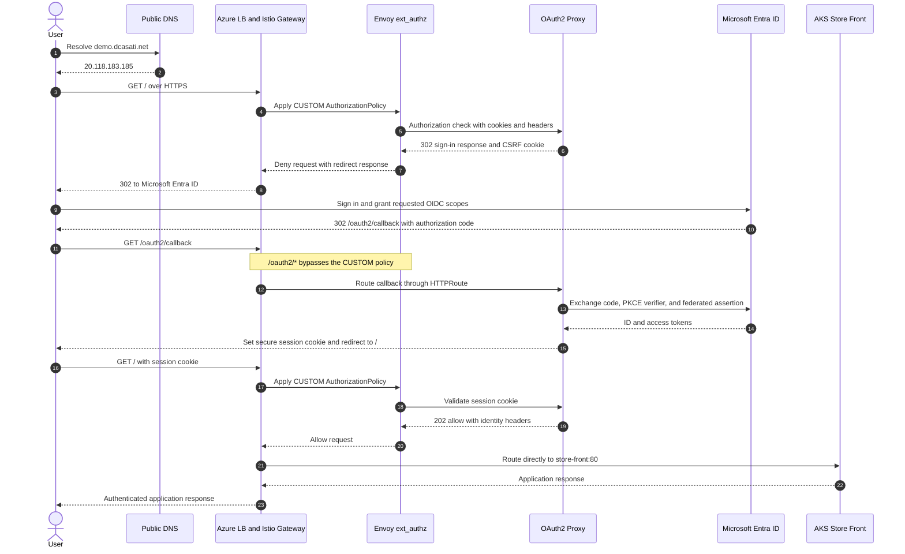

# OAuth2 Proxy and Istio Request Flow

The ACME path `/.well-known/acme-challenge/*` also bypasses external authorization so cert-manager can issue and renew the TLS certificate for `demo.dcasati.net`.